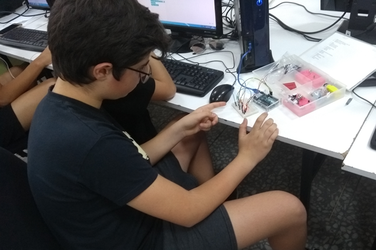

# Club maker de robótica en Murcia

En el club maker pueden participar todos los alumnos del IES Alfonso X "El sabio" de Murcia. Los participantes aprenderán a construir robots pasando por las diferentes etapas de diseño, impresión, fabricación y programación.

## ¿Quién puede participar?

El club maker está destinado a alumnos del IES Alfonso X de Murcia. Para participar tienes que enviarnos un email accediendo al formulario de contacto y te indicaremos los pasos a seguir.

## ¿Cuándo se realiza?

Los talleres de programación y robótica se realizan durante el curso escolar los viernes por la tarde de 16:00 a 18:00 en el aula de tecnología del centro.

## ¿Cuánto hay que pagar?

Los talleres son totalmente gratuitos, gracias al convenio de colaboración entre la Concejalía de Juventud y Cooperación al Desarrollo del Ayuntamiento de Murcia y el IES Alfonso X El Sabio (Murcia), para la promoción y puesta en marcha de actividades extraescolares durante el curso escolar.

## ¿Quién organiza CoderDojo Murcia?

Club maker Murcia es un Club gratuito de Programación y Robótica para jóvenes de 12 a 17 años subvencionado por la Concejalía de Juventud y Cooperación al Desarrollo del Ayuntamiento de Murcia.

Los materiales de electrónica y robótica utilizados en los talleres han sido adquiridos gracias a **subvenciones concedidas para el fomento de la participación juvenil en el municipio de Murcia por la Concejalía de Juventud del Ayuntamiento de Murcia**.
