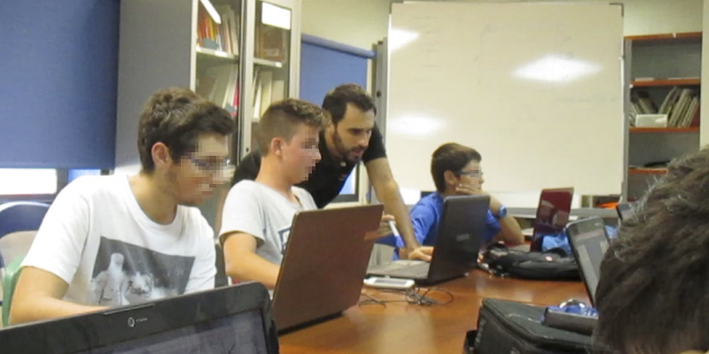

# CodeWeek Murcia

La Semana de la Programación de la UE es una iniciativa popular organizada por voluntarios que fomentan la programación, el pensamiento computacional y actividades relacionadas en sus países.

Aprender a programar nos ayuda a comprender nuestro mundo actual, altamente tecnificado y sometido a continuos cambios tecnológicos, comprender cómo funciona la tecnología que usamos y desarrollar habilidades y capacidades valiosas para la creación y la innovación

## Eventos de CodeWeek en Murcia

- https://codeweek.eu/view/4144/aprende-a-programar-videojuegos
- https://codeweek.eu/view/3668/aprende-a-programar-videojuegos-y-aplicaciones
- https://codeweek.eu/view/5814/aprende-a-programar-videojuegos-con-frozen
- https://codeweek.eu/view/4145/aprende-a-programar-aplicaciones
- https://codeweek.eu/view/5815/aprende-a-programar-paginas-web
- https://codeweek.eu/view/4146/juega-y-programa-un-juego-en-3d
- https://codeweek.eu/view/4147/maraton-descubre-la-programacion-y-coderdojo-murcia
- https://codeweek.eu/view/5811/coderdojo-murcia
- https://codeweek.eu/view/141278/club-gratuito-de-programacion-y-robotica
- https://codeweek.eu/view/141282/club-gratuito-de-programacion-y-robotica
