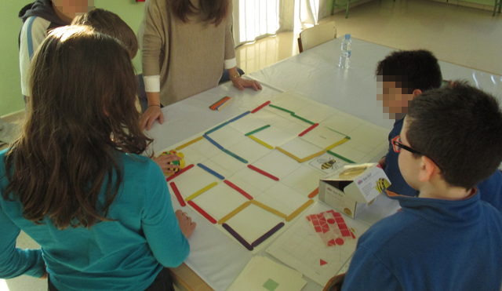
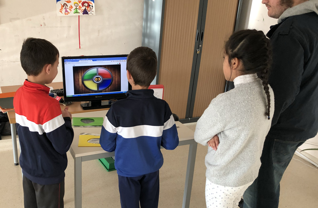

# Programación y Robótica inclusiva TEA

Robótica TEA inclusiva pretende estrechar la brecha tecnológica de la población realizando talleres gratuitos inclusivos con ayuda de voluntarios con conocimientos en inclusión y nuevas tencologías.

## ¿Quién puede participar?

Los talleres están destinados a asociaciones de personas con autismo u otra diversidad funcional de la Región de Murcia. Para participar tienes que enviarnos un email accediendo al formulario de contacto y te indicaremos los pasos a seguir.

## ¿Cuándo se realiza?

Los talleres de programación y robótica inclusiva se realizan preferiblemente durante los periodos estivales de navidad, semana santa o verano en horario deseado por la organización.

## ¿Cuánto hay que pagar?

Los talleres son totalmente gratuitos para la asociación, incluyendo desplazamiento, materiales de robótica, etc. Lo único a lo que se compromete la asociación es a aportar voluntarios, terapeutas, etc, para la realización del taller.

<!--

-->