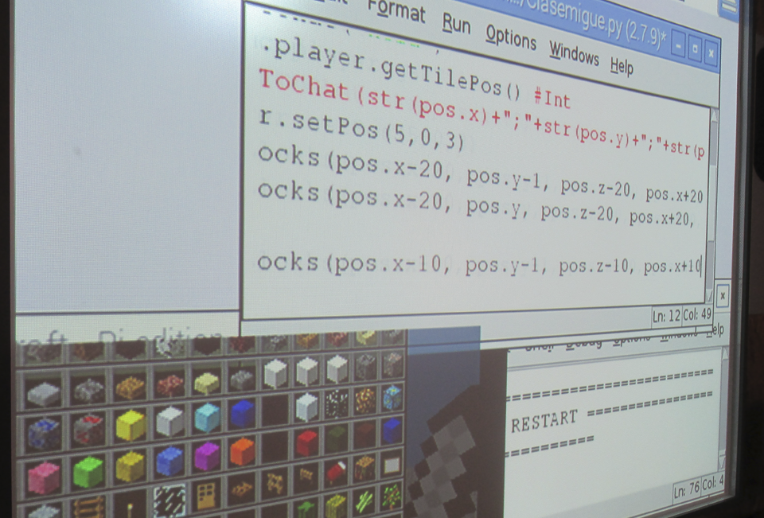

# Curso de programación en Minecraft en Murcia

Finaliza el cruso de programación de videojuegos para chicos de 14 años en el IES el Carmen de Murcia.

En este curso gratuito subvencionado por el programa Redes para el Tiempo Libre de los Jóvenes de Murcia, han participado un total de 8 alumnos con edades comprendidas entre los 14 y los 24 años.

Durante las primeras sesiones, los participantes comprendieron el concepto de la programación de videojuegos así como conceptos avanzados del paradigma de la programación orientada a objetos.

Aprender a programar en Python en Murcia

En las siguientes clases aprendieron a programar el lenguaje de programación Python, y con ayuda de Minecraft, pudieron poner en práctica todo lo aprendido.

Nos vemos en el próximo curso de Programación de VideoJuegos con Minecraft en Python!
