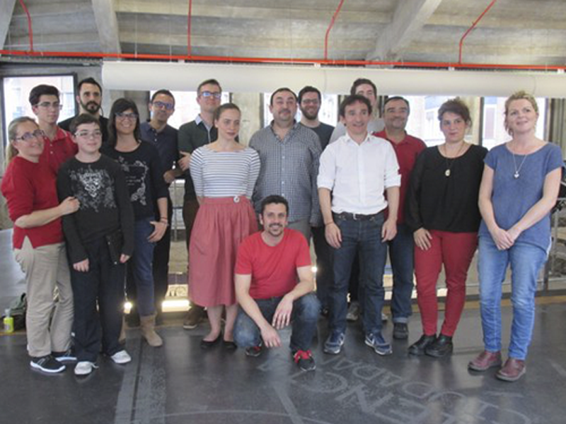

# I encuentro de CoderDojo España en Medialab Prado, Madrid

Este fin de semana desde el 15 al 17 de abril, champions y mentores de CoderDojo Murcia han asistido a las instalaciones de MediaLab Prado en Madrid para reunirse con el resto de champions y mentores de CoderDojo de España, entre otros. Han asistido champions y mentores de Bilbao, León, Valencia, Madri y Murcia.

El objetivo de la reunión era presentarnos a la CoderDojo Foundation que también estaba en Madrid dentro de la iniciativa Erasmus+.

Durante la presentación de los CoderDojo de España aprendimos qué lenguajes de programación se aplican: Scratch, AppInventor, Java, HTML5, Sonic Pi, Processing, Minetest y muchas más herramientas que sirven como excusa para que los ninjas aprendan y desarrollen otras habilidades además de que se generan lazos de amistad entre ellos.

De la sesión entre los mentores de los CoderDojo de España hablamos de cómo mejorar el proceso de captación de mentores y de las experiencias de desarrollo de las sesiones con los ninjas. Todos los Dojos estuvimos de acuerdo en seguir trabajando en el compromiso y participación de los padres, en la necesidad de difundir las experiencias, en definir tareas a realizar y en dotar de herramientas a los que quieran incorporarse como mentores. Aunque ya estamos poniendo en práctica muchas iniciativas para seguir mejorando, como la página en Internet de CoderDojo.es, que incluye guías y tutoriales, la difusión de las sesiones con contenidos, o la rápida respuesta ante peticiones de ayuda y es que cada sábado atendemos comentarios y demandas de padres que quieren conocer más sobre el proyecto.

Con este encuentro esperamos conseguir más mentores involucrados en enseñar a programar a niños de 7 a 17 años.
