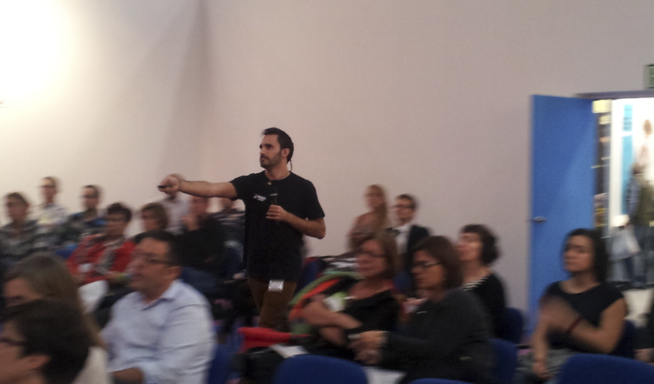
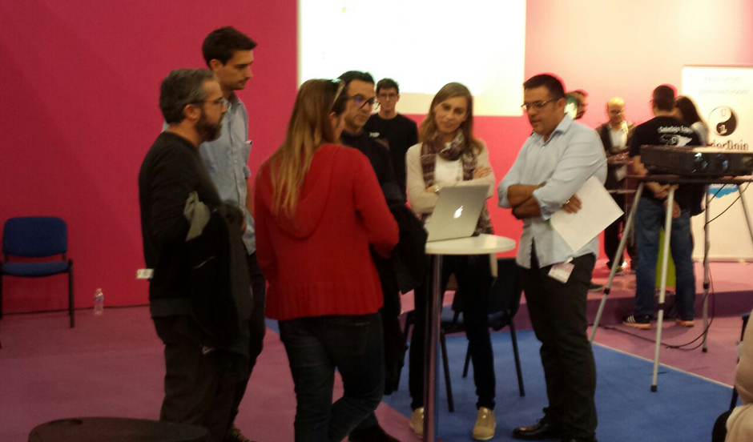
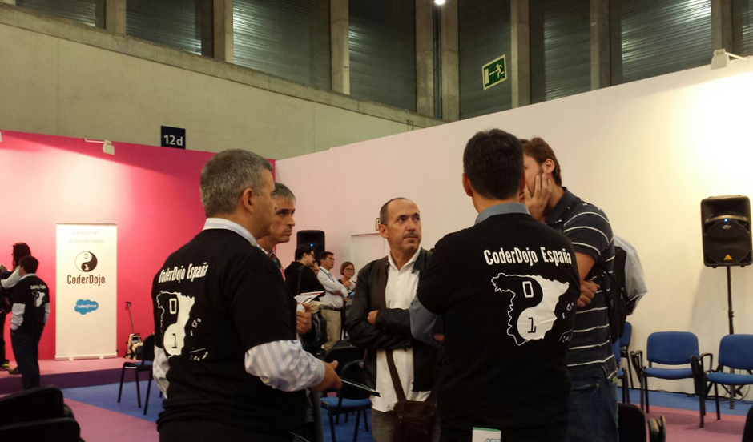
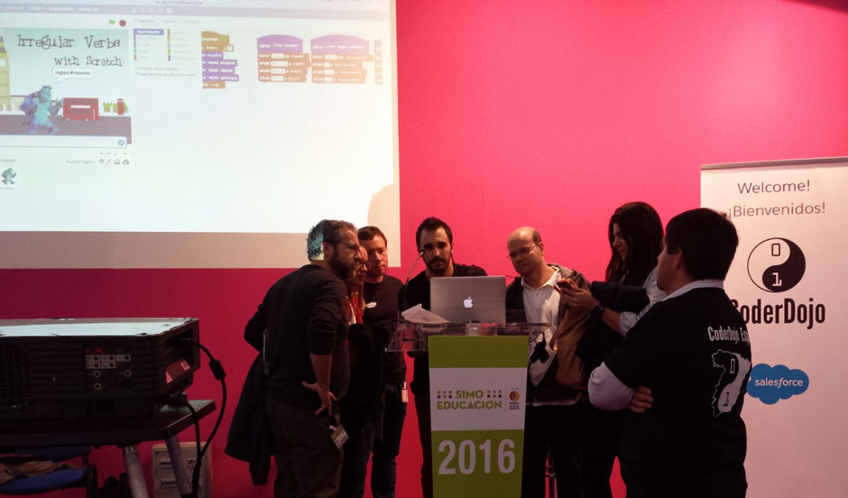
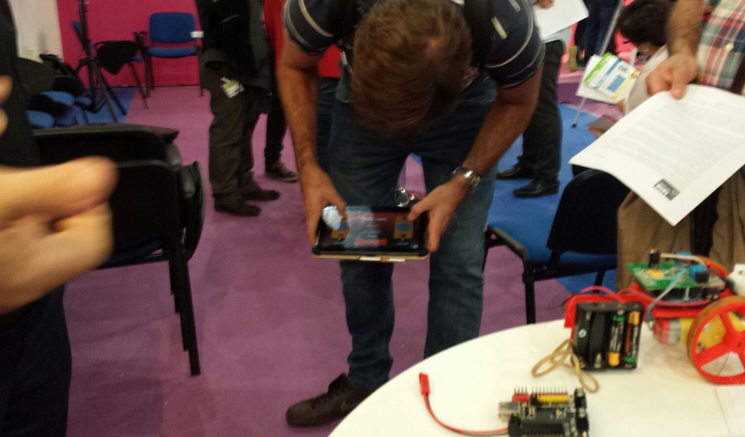

# Presentes en SIMO Educación 2016

Programo Ergo Sum estuvo presente en la pasada edición de SIMO Educación 2016, participando en un taller para maestros y profesores e impulsando la programación informática como medio hacia el aprendizaje en otras asignaturas.

El taller tuvo lugar la tarde del miércoles 19 de octubre de 2016. Un taller organizado por la Asociación CoderDojo España y la Fundación CoderDojo donde participaron mentores de varios dojos de España (Cáceres, León, Madrid, Murcia y Valencia) así como otras asociaciónes de Innovación Educativa como ByL InEdu de Valencia y Programo Ergo Sum de Murcia, y también empresas multinacionales como SalesForce.

La jornada comenzó con una ponencia de nuestro Presidente de la Asociación CoderDojo España donde remarcó la importancia de fomentar la curiosidad en niño hacia el aprendizaje ayudado por mentores relacionados con el mundo de la programación y las nuevas tecnologías.

CoderDojo León presentó una programación desenchufada. Un taller para aprender a programar sin ordenador, explicando por ello la gran importancia que tiene el pensamiento computacional.

CoderDojo Madrid Medialab-Prado presentó aplicaciones móviles realizadas con AppInventor en los talleres madrileños. Además también se explicaó la metodología que se sigue en los talleres de CoderDojo.

CoderDojo Madrid SalesForce explicó las diferentes posibilidades de atraer a los niños al mundo de la programación con un soporte físico y divertido. Los robots hacen que el niño presete más atención.

CoderDojo Murcia presentó la herramienta de Scratch como medio de aprendizaje dentro del aula en las diferentes asignaturas de los niños, como matemáticas, física, geografía, inglés, etc.

CoderDojo Valencia presentó el uso de AppInventor gestionando una tarjeta Mioio desde dispositivos Android, proporcionando ejemplos de robótica dirigida desde un terminal móvil.

CoderDojo España se despide de SIMO 2016 preparando nuevos eventos para el próximo SIMO Educación 2017.

¡Nos volveremos a ver!
