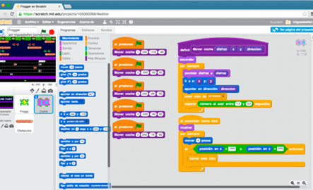
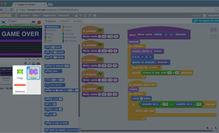
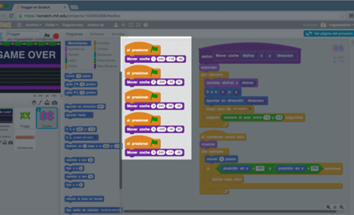
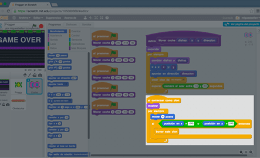
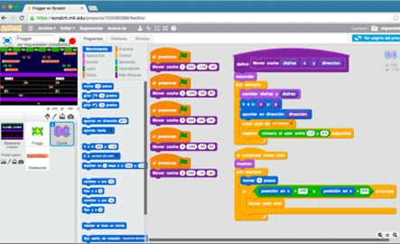

# Programación Orientada a Objetos con Scratch

Scratch es un entorno gráfico de programación desarrollado por un grupo de investigadores del Lifelong Kindergarten Group del Laboratorio de Medios del MIT, bajo la dirección del Dr. Mitchel Resnick.

Este entorno gráfico hace que la programación sea más atractiva y accesible para todo aquel que se enfrenta por primera vez a aprender un lenguaje de programación. Según sus creadores, fue diseñado como medio de expresión para ayudar a niños y jóvenes a expresar sus ideas de forma creativa, al tiempo que desarrollan habilidades de pensamiento lógico.

> Scratch permite crear fácilmente historias interactivas propias, animaciones, juegos, grabar sonidos y realizar creaciones artísticas.

La aplicación de los lenguajes de programación por bloques permiten una presentación visual del paradigma y metodología de la programación informática permitiendo centrarse en la lógica de la programación dejando a un lado la sintaxis propia de los lenguajes de programación (puntos y comas, paréntesis, etc).

## Programación Orientada a Objetos con Scratch

Además de aprender a programar, aprenderemos buenas prácticas de programación, pero sobre todo el paradigma de la programación, y metodologías como programación orientada a objetos, programación concurrente, etc. Un ejemplo de los conceptos avanzados que se pueden explicar con Scratch los representamos en las siguientes imágenes.

### Programación por bloques

El lenguaje de programación por bloques de Scratch es muy sencillo e intuitivo y simplemente debemos formar un "puzle" para programar determinadas acciones.

### Programación Orientada a Objetos

Con este paradigma de programación, los objetos manipulan los datos y cada objeto ofrece una funcionalidad especial. En este caso el mismo objeto toma diferentes posiciones, diseños, velocidades, etc.

### Programación Concurrente

Mediante la programación concurrente simulamos varios procesos que se ejecutan de forma paralela. En este ejemplo, tanto los vehículos como los troncos se lanzan al mismo tiempo.

### Abstracción de datos

Una parte importante de la metodología de la programación es la reutilización de código. En este caso la misma función se encarga de realizar la misma funcionalidad según los datos que se le pasan por parámetro.

### Liberación de memoria

Con esta técnica nuestros procesos se realizan más rápido aprovechando al máximo los recursos utilizados por el juego. En este caso eliminamos los vehículos una vez llegan al final.

### Buenas prácticas

La programación es una ciencia que se encarga de diseñar, codificar, depurar y mantener el código de los programas. No basta con programar, hay que hacerlo bien

 

Con las anteriores imágenes queda demostrado que la programación con Scratch puede ser un juego de niños, si, pero también es una herramienta muy poderosa para iniciarse en la programación, ya que se adquieren conceptos importantes de una forma muy sencilla.

## ¿Te gustaría aprender a programar?

Si eres de los que se interesa por la programación informática, y todavía no sabes por qué lenguaje empezar, te recomendamos Scratch para iniciarte en la programación de videojuegos, historias de animación, aplicaciones, etc., ya que con esta herramientas el aprendizaje es mucho más sencillo y divertido.

Accede en esta misma plataforma a todos los cursos de programación con Scratch donde se explican conceptos y buenas prácticas del paradigma de la programación y programación orientada a objetos.
