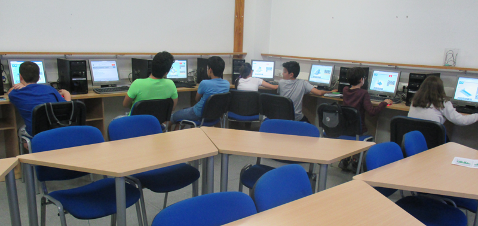
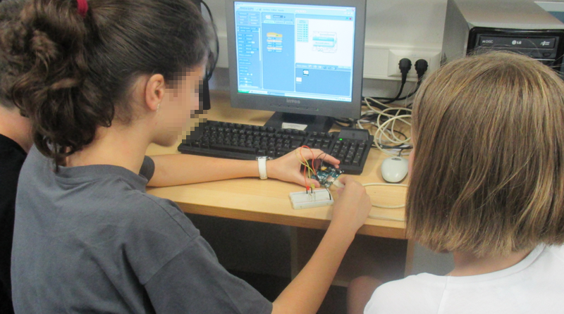

# Semana tecnológica en el IES Juan Carlos I

Durante esta semana se han llevado a cabo varios talleres de programación informática y nuevas tecnologías en el IES Juan Carlos I de Murcia. Una semana tecnológica promovida por la Asociación de madres y padres de alumnos del Instituto de Enseñanza Secundaria Juan Carlos I.

En la tarde del lunes, los chicos y chicas del centro se adentraron en el fantástico mundo de la programación de videojuegos. Empezaron utilizando la herramienta gratuita de Scratch para animar un pequeño videojuego y vieron todo lo que puede llegar a realizarse con la programación de videojuegos. También pudieron ver otras herramientas más avanzadas con Unity 3D para la creación de videojuegos más profesionales.

La tarde del martes estuvo dedicada a la programación de páginas web utilizando HTML5 y CSS3. Los alumnos realizaron modificaciones en una pequeña página web y la alojaron en servidores gratuitos. También pudieron ver lo que se puede llegar a programar mediante lenguajes de programación de alto nivel como JavaScript, PHP, etc.

El miércoles tocaba programar aplicaciones para dispositivos android. En este taller, los alumnos realizaron el típico juego persigue. Habían 3 personajes y mediante acelerómetro tenían que conseguir objetivos al mismo tiempo que un personaje les perseguía. No solo hicieron la aplicación sino que ademas la instalaron en sus respectivos dispositivos de android.

Por último, y para terminar la semana tecnológica del IES Juan Carlos I, los alumnos del centro estuvieron programando circuitos eléctricos y placas de hardwarelibre como arduino. Realizaron diferentes prácticas con leds, resistencias, etc, ademas de controlar un coche teledirigido mediante bluetooth. En este taller los alumnos se dieron cuenta de la importáncia que tiene el inglés, la física y las matemáticas entre otras asignaturas, en el mundo de las nuevas tecnologías.

Sobre nuestra valoración personal, hemos podido comprobar que nos encontramos ante futuros científicos e ingenieros, y además, muchos de ellos prometen llegar lejos.
